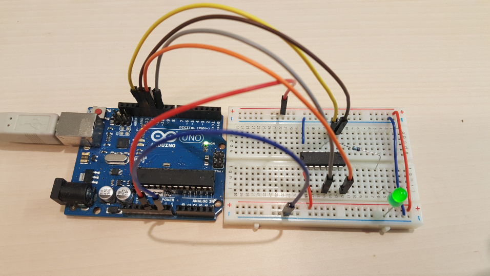

# Turn an Arduino UNO into an AVRISP, and make an LED blink

Mainly read and follow this [four part series](https://hackaday.com/2010/10/23/avr-programming-introduction/).

The short summary is:

* Arduino IDE ships with a [sample project](./ArduinoISP/ArduinoISP.ino) ('sketch' in Arduino terminology) to use an Arduino as an ISP for AVR chips. Just flash your Arduino from the IDE following any Arduino tutorial.
* Put the AVR chip in a breadboard, connect the Arduino and make and flash the [blink project](./blink/). This code and Makefile is based on that given in the hackaday tutorial linked above.

In slightly more detail:

The `Makefile` and `main.c` in the [blink](./blink/) have been tailored to the ATTiny44 chip that I am using. If using another chip the port/pin used in the blink code made need tweaking, also the names of other timer registers and interrupt service routine. Check datasheets.

Also, if using another chip the `MCU` variable in the `Makefile` should be updated accordingly.

Place the ATTiny44 into a breadboard. Use jumpers from the Arduino's `5v` and `GND` to the power rails on the breadboard, and connect the `VCC` and `GND` pins on the ATTiny to the power rails.

On the UNO, the four connections needed to program the AVR chip are pins 10, 11, 12, and 13, which should be connected to the `RESET`, `MOSI`, `MISO`, and `SCK` pins respectively on the AVR. On the ATTiny44 these are pins 4, 7, 8, and 9 respectively.

You'll probably need to update the `PORT` variable in the `Makefile` to reference the Arduino correctly. It should be something like `/dev/tty*`. You can find the relevant value by checking `dmesg` soon after plugging in the Arduino.

Make and flash the ATTiny with `make`.

Connect a resistor and LED to the appropriate pin and see it flashing.



## udev rules

To have your Arduino show up as a consistent name in `/dev/` you can use a udev, rule. This targets the rev 3 UNO that I'm using and makes it always available as `/dev/arduino-uno-r3`:

`/etc/udev/rules.d/50-arduino.rules`


```
KERNEL=="ttyACM[0-9]*", SUBSYSTEM=="tty", SUBSYSTEMS=="usb", ATTRS{idVendor}=="2341", ATTRS{idProduct}=="0043", SYMLINK+="arduino-uno-r3"
```

See [the Arch wiki](https://wiki.archlinux.org/index.php/Udev#udev_rule_example) for a helpful description.
