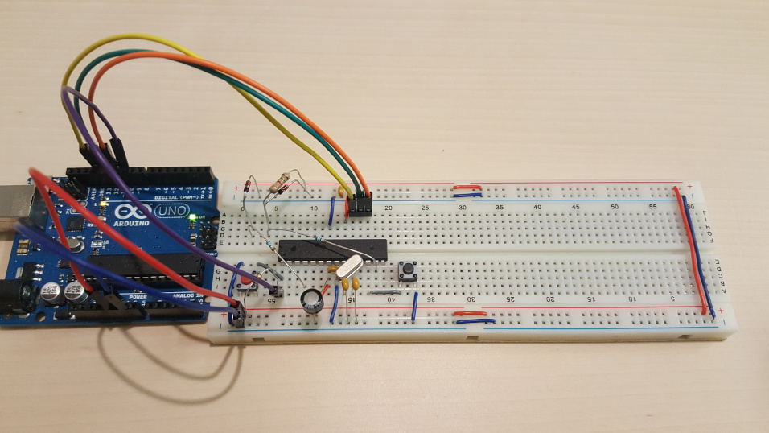
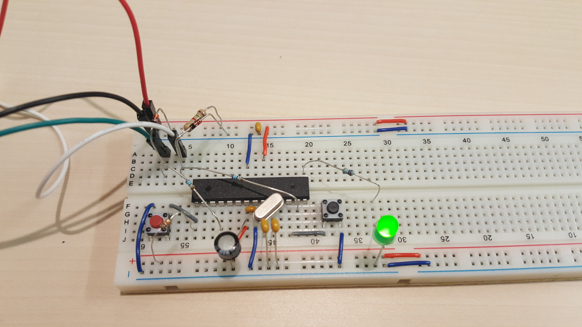

# Mini-metaboard on a breadboard

Here is my cut-down [metaboard](https://metalab.at/wiki/Metaboard) on a breadboard (while getting the bootloader flashed).



There's a few component differences, based on what I had, and it's cut down in the sense of not having the DC jack and associated diode, capacitor and regulator.

I've placed a switch on the board for jumper 6 to enter to enter the boot loader.

This is essentially an ATMega168 with minimal components to power the chip, have an external crystal, and use [vusb](https://www.obdev.at/products/vusb/index.html) for the USB connection. With the USBasbLoader bootloader, allowing it to self-program.

I've [forked USBapbLoader](https://github.com/ljwall/USBaspLoader) just to adjust the Makefile for initially programming the bootloader with the Arduino UNO.

The pins referenced for [usb D-](https://github.com/ljwall/USBaspLoader/blob/a8aff30bded09f3275268ff1244ca353fc6d6bc5/firmware/bootloaderconfig.h#L74) and the [bootloader jumper](https://github.com/ljwall/USBaspLoader/blob/master/firmware/bootloaderconfig.h#L94) don't match what is currently shown one the schematic on the Metaboard homepage, so I've set up the breadboard in line with the current code.

Finally, connecting up a USB B connector to the breadboard, it possible to use the bootloader on the ATMega168 to flash further software without the use of the Arduino as a programmer.

Here is the [inevitable LED blinker](./blink_usbasp/) (using Port B bit 1, which is pin 15). The c code is slightly adjusted compared to the ATTiny44 example (no Port A, different interrupt name, different clock speed), and `Makefile` is set up to program with the USBasp programmer, which the boot loader masquerades as. To program, with the board powered up via USB, press and hold the reset button (red in photo) and then press on hold the bootloader-mode button (black), release reset then release the boot mode button. You should see a new USB device showing up in `dmesg` and `lsusb`. After that	`make` should build `main.hex` and flash the AVR, and then after pressing reset again, the LED should blink.

The four wires in the photo are coming from a USB cable connected directly to my machine. Red = 5v, black = 0v, green = D+, white = D-.



Note, if you get any kind of permissions issues you may need to grant yourself access to that USB device. Drop a file `/etc/udev/rules.d/50-myusb.rules` containing

```
SUBSYSTEMS=="usb", ATTRS{idVendor}=="16c0", ATTRS{idProduct}=="05dc", GROUP="users", MODE="0666"
```

then reload udev rules `sudo udevadm control --reload`, `sudo udevadm trigger`.

Here is [the schematic](./prototype_board.pdf). On the breadboard I've not included the various groups of heaer pins (`J2`, `J3`, J4`) and jumper (`JP1`) nor the resetable fuse (`F1`) but they'll be there when I make build the PCB.
