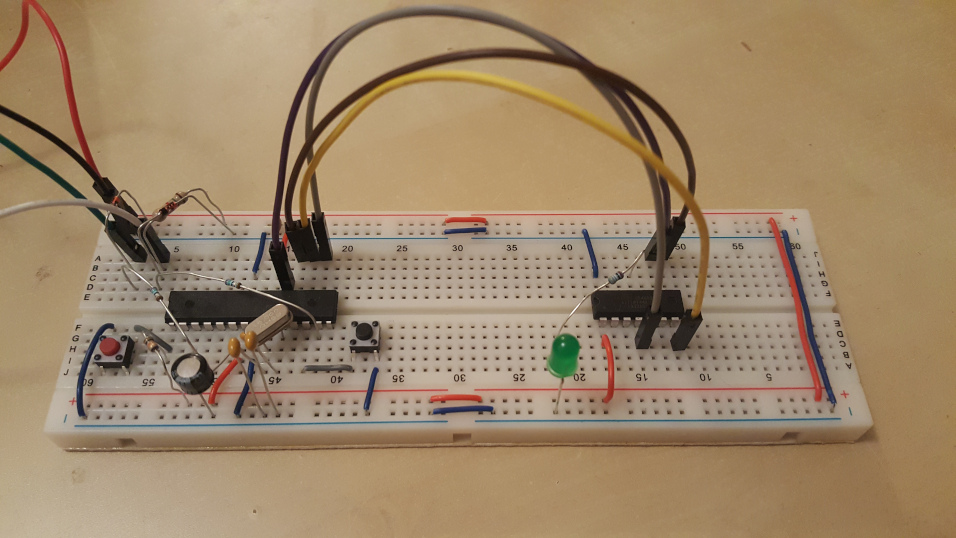

# AVRProg on a breadboard

With the USBasp bootloader in place, we can directly flash the ATMega with firmware to act and an ISP for programming further AVR chips, and we're fully bootstraped and no longer rely on the Arduino.

There seem to be a few source of firmware that can work.

I tested [this one](http://matrixstorm.com/avr/tinyusbboard/firmwares.html) and it worked, but I can't seem to find the code anywhere there, only precompiled hex files.

The code provided on the metaboard page needed some updating to get it to work. [Here it is](https://github.com/ljwall/arvprog-metaboard).

Flash it to the breadboard metaboard with

```
make flashmetaboard
```

Having done that, after resting, can use the ATMega to flash other AVR chips, like here, flashing b`blink` on to the ATTiny.

To do so, supply power to the ATTiny, connect `MISO`, `MOSI`, and `SCK` of the two chips, and connect `PB2` of the ATMega to the `RESET` pin of the tiny. Add the resistor/LED for blinking.

Then you can flash the [ATTiny blink firmware](../01_arduino_isp_blink/blink), subject to changing the `Makefile` with the following diff:

```diff
--- a/01_arduino_isp_blink/blink/Makefile
+++ b/01_arduino_isp_blink/blink/Makefile
@@ -26,7 +26,7 @@ TARGET = main
 # to get a full listing.
 # AVRDUDE_PROGRAMMER = dapa              # official name of 
 # AVRDUDE_PROGRAMMER = dragon_isp
-AVRDUDE_PROGRAMMER = arduino_avrisp
+AVRDUDE_PROGRAMMER = usbasp
 #AVRDUDE_PROGRAMMER = usbtiny
 
 #AVRDUDE_PORT = usb:001:011
@@ -134,7 +134,7 @@ AVRDUDE_WRITE_FLASH = -U flash:w:$(TARGET).hex
 #AVRDUDE_WRITE_EEPROM = -U eeprom:w:$(TARGET).eep
 
 #AVRDUDE_FLAGS = -p $(MCU) -P $(AVRDUDE_PORT) -c $(AVRDUDE_PROGRAMMER)
-AVRDUDE_FLAGS = -p $(MCU) -P $(AVRDUDE_PORT) -c $(AVRDUDE_PROGRAMMER)
+AVRDUDE_FLAGS = -p $(MCU) -c $(AVRDUDE_PROGRAMMER)
 
 # Uncomment the following if you want avrdude's erase cycle counter.
 # Note that this counter needs to be initialized first using -Yn,
```

Note, I've removed the use of `$PORT` from the avrdude flags --- it seems to work without --- perhaps avrdude is now able to scan and find the port without specifying it.


